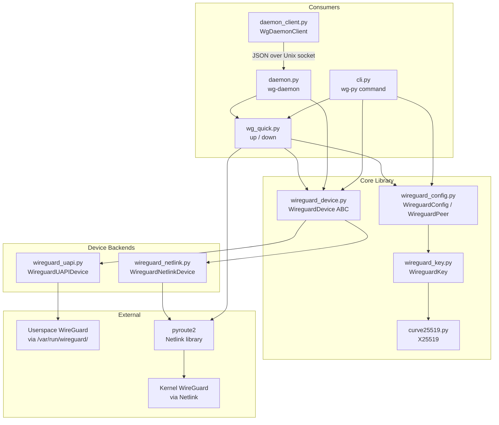
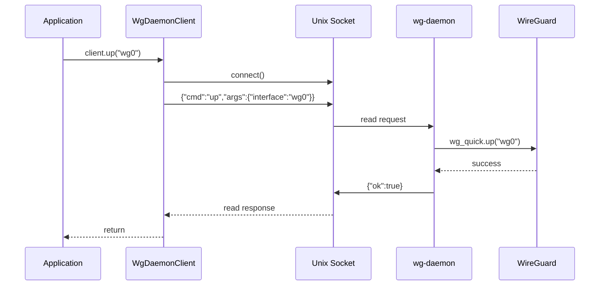

# Architecture

## Module Map

| Module | Purpose |
| --- | --- |
| `wireguard_key.py` | Key parsing (base64, hex, urlsafe), generation, and public key derivation |
| `curve25519.py` | Pure-Python Curve25519 scalar multiplication (no C dependencies) |
| `wireguard_config.py` | `WireguardConfig` and `WireguardPeer` data classes; parsing and serialization of `.conf` files and dict roundtrips |
| `wireguard_device.py` | `WireguardDevice` abstract base class with backend discovery (`get()` and `list()`) |
| `wireguard_uapi.py` | UAPI backend -- communicates with userspace WireGuard via `/var/run/wireguard/<ifname>.sock` |
| `wireguard_netlink.py` | Netlink backend -- communicates with in-kernel WireGuard via `pyroute2` |
| `wg_quick.py` | Pure-Python `wg-quick up/down` using `pyroute2` for interface, address, route, and rule management |
| `cli.py` | `wg-py` command-line interface implementing all `wg(8)` subcommands plus `up`/`down` |
| `daemon.py` | `wg-daemon` -- threaded Unix socket server dispatching JSON commands to library functions |
| `daemon_client.py` | `WgDaemonClient` -- thin IPC client for connecting to `wg-daemon` |
| `__init__.py` | Public API surface: re-exports `WireguardConfig`, `WireguardPeer`, `WireguardDevice`, `WireguardKey` |

## Layer Diagram

## Backend Selection

`WireguardDevice.get(ifname)` selects the backend automatically:

1. **UAPI first**: Checks for `/var/run/wireguard/<ifname>.sock`. If the socket exists, returns a `WireguardUAPIDevice`. This handles userspace WireGuard implementations (e.g., wireguard-go, boringtun).
2. **Netlink fallback**: If no UAPI socket is found, returns a `WireguardNetlinkDevice` which talks directly to the in-kernel WireGuard module via `pyroute2`.

`WireguardDevice.list()` yields devices from both backends, querying Netlink first and then scanning the UAPI socket directory.

## setconf vs syncconf

Both backends now implement distinct behaviors:

- **`set_config()`** (setconf semantics): Atomically replaces the full interface configuration. Sends `replace_peers=true` in UAPI; in Netlink, diffs against current state but applies all peers.
- **`sync_config()`** (syncconf semantics): Diffs the desired config against the running config and applies only changes -- removes absent peers, skips unchanged ones, updates modified ones.

## Data Flow: `wg-quick up wg0`

1. `_find_config("wg0")` resolves to `/etc/wireguard/wg0.conf`
2. Config file is parsed into a `WireguardConfig` object
3. PreUp hooks execute (shell commands with `WIREGUARD_INTERFACE` env var)
4. `pyroute2` creates the `wg0` interface (`ip link add wg0 type wireguard`)
5. `WireguardDevice.get("wg0")` opens the appropriate backend
6. `device.set_config(config)` applies keys, peers, and endpoints via UAPI/Netlink
7. Addresses are assigned via `pyroute2` (`ip addr add`)
8. Link is brought up with MTU (`ip link set wg0 up mtu 1420`)
9. Routes are added for each peer's AllowedIPs
10. If catch-all AllowedIPs (`0.0.0.0/0` or `::/0`) are present with `Table = auto`, fwmark rules and suppress-prefix rules are installed
11. DNS is configured via `resolvconf` if DNS servers are specified
12. PostUp hooks execute

If any step after interface creation fails, the interface is deleted to avoid leaving a half-configured device.

## Data Flow: Daemon IPC

The daemon handles one request per connection. The client connects, sends a
single JSON line, shuts down the write side, reads the response, and
disconnects. This stateless design avoids connection management complexity.
